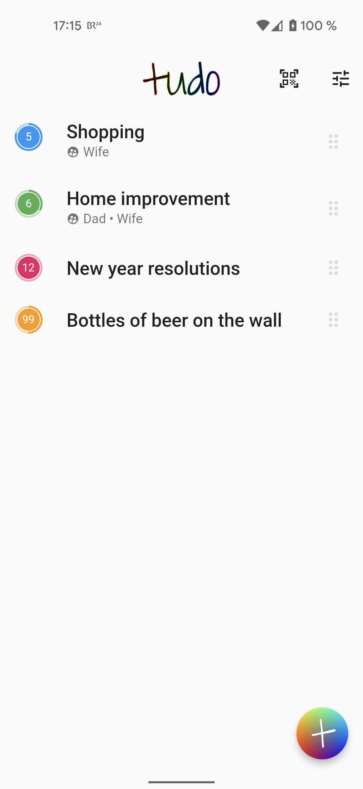
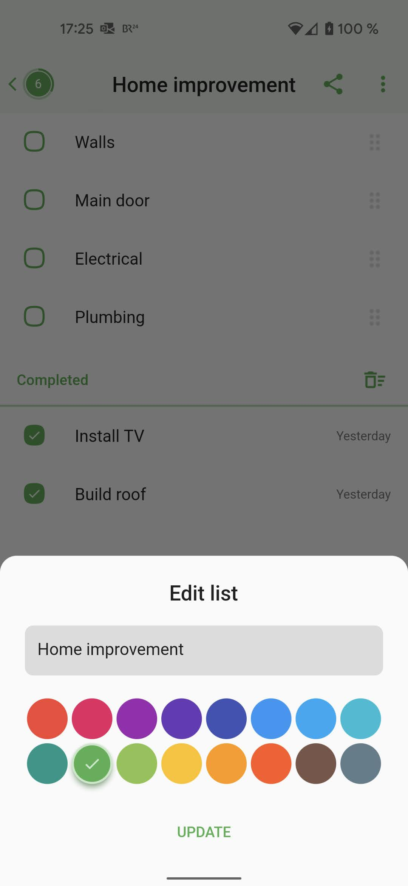
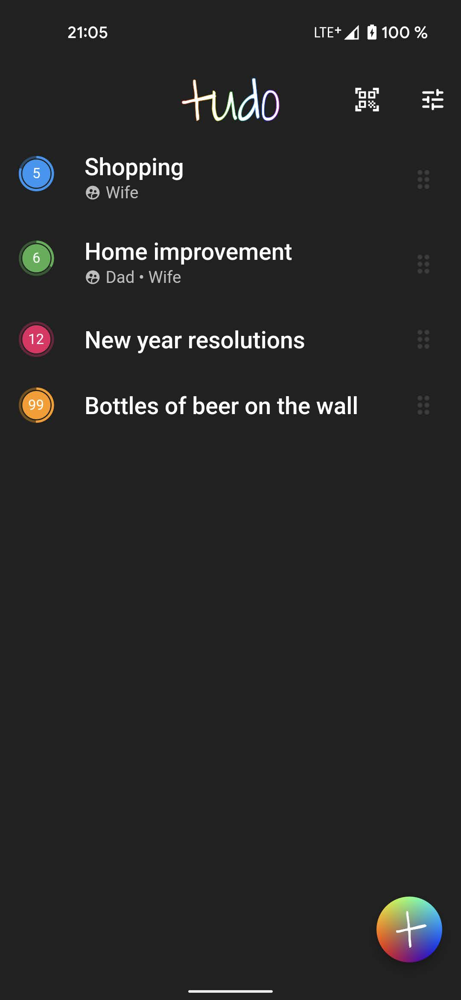

tudo is an experiment on simple, private, synchronized to-do lists.

## Try it out

The server part of this project can be found here: [tudo_server](https://github.com/cachapa/tudo/tudo_server).

## Features

* **Anonymous** 
No mandatory user accounts or tracking of any sort.

* **Shareable** 
Lists can be shared between your devices or trusted contacts simply using the list id.

* **Real-time** 
Changes to lists propagate immediately to every connected device where the app is open and online.

* **Private** 
Each to-do list has a random unique identifier that is effectively impossible to guess.

* **Offline-first** 
No loading screens. The app stores all the data it needs locally and works perfectly without a connection.

* **Multiplatform** 
Mobile apps for Android and iOS, and more to come.

* **Open-source** 
Look at how it's built. Modify it. Host it yourself. Maybe help me improve it?

## How it works

To do lists are stored on the device as [CRDTs](https://github.com/cachapa/crdt) which enable conflictless synchronization with an essentially unlimited number of devices. Every device maintains a local copy of the entire database.

A live websocket connection to the server is kept open whenever the app is active and network is available. Local changes are immediately pushed to the network, and remote changes are pulled in real-time. This promotes rapid consistency of the database between all active devices in the network, and allows users to immediately see those changes in the interface.

The clients are built using [Flutter](https://flutter.io), which makes it possible to build applications for all popular platforms from a single shared codebase.

## How to contribute

Please file feature requests and bugs at the [issue tracker](https://github.com/cachapa/tudo/issues).

